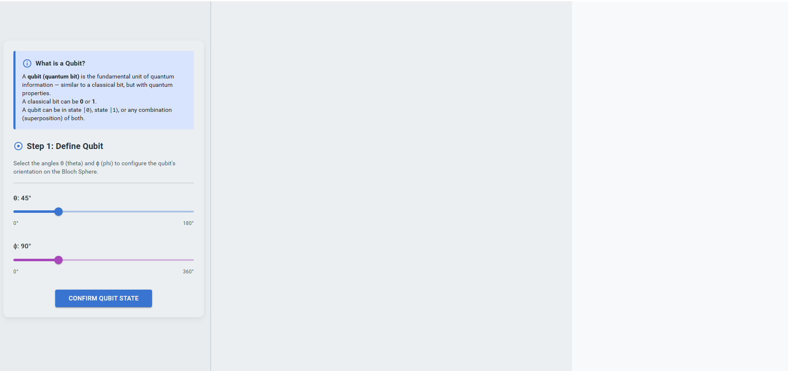
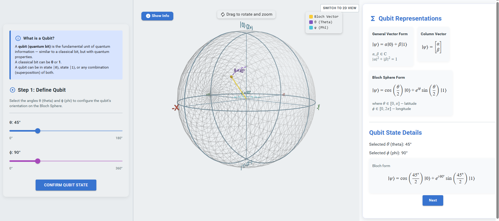
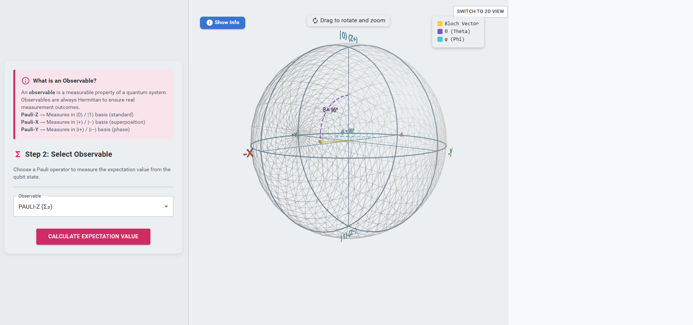
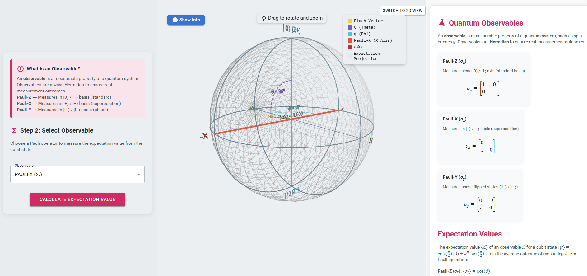
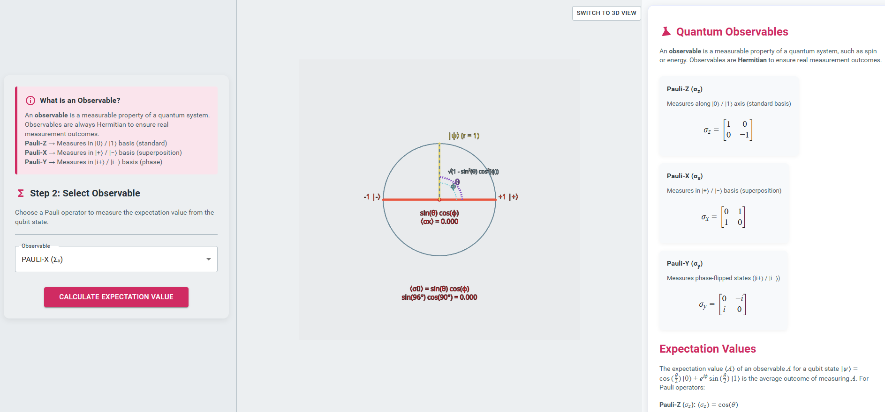

1. **Define the Qubit State:**  
Adjust the angles **θ (theta)** and **φ (phi)** using the sliders to configure the qubit’s orientation on the Bloch sphere. After setting the desired values, click the **“Confirm Qubit State”** button to proceed.

2. **Observe the Qubit Representation:**  
After confirming the qubit state, observe the **Bloch sphere visualization** in the central panel and the **mathematical representation of the qubit** in the right panel. 

3. **Proceed to the Next Step:**  
Click the **“Next”** button to move to the observable selection step.

4. **Select an Observable:**  
Choose an observable (Pauli operator) from the **dropdown menu** shown in the left panel and click **“Calculate Expectation Value”** to compute the expectation value of the selected observable.

5. **Analyze the Result:**  
Observe the **projection of the observable on the Bloch sphere** in the central panel and review the **expectation value calculation** displayed on the right panel.

6. **View the 2D Representation:**  
Click the **“Switch to 2D View”** button to observe the **two-dimensional representation** of the qubit state.

